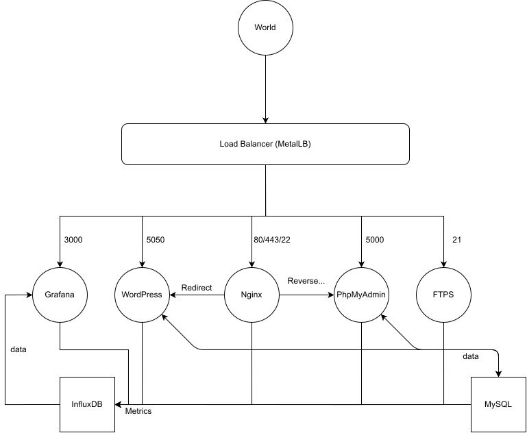

# ft_services

A clustering project for 42.

## Cluster

## Setup

In the VM you may need to :
- Check if you have 2 CPUs in the VM settings.
- Stop the default nginx server with : `service nginx stop`
- Add the user to the docker group so minikube may use docker properly with : `sudo usermod -aG docker $USER`. You the need to unlog and relog for the change to take effect.

Then finally : `./setup.sh`

## Features

- Metallb is the only entry point.
- A wordpress CMS.
- A FTPS.
- A Grafana monitoring all pods.
- Mysql and Influxdb are persistent.
- All pods restart if one of their component fails using liveness probes.

## ID

- **Grafana** : admin / admin
- **PHPmyadmin** : wp_user / password
- **Wordpress** : salut / salut
- **FTPS** : ftps_user / NO_PASSWORD